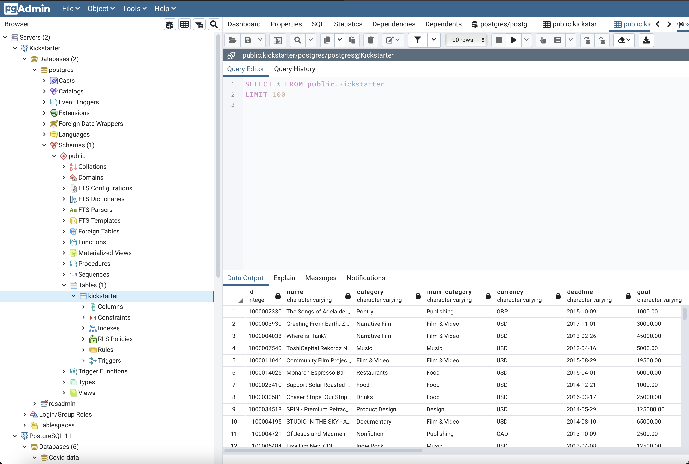

kickstarter data: https://colab.research.google.com/drive/1OUyPDToPlTRJQKJIKoCgKvqv4ERdRUh-?usp=sharing
app aws link: http://kickstarter-env.eba-kcr5xpvr.us-east-2.elasticbeanstalk.com
aws large files:
https://laurentvh-kickstarter.s3.us-east-2.amazonaws.com/latest_data.csv
https://laurentvh-kickstarter.s3.us-east-2.amazonaws.com/clean_data.csv

# Kickstarter Campaigns

Creating a Machine Learning model to predict kickstarter campaign success and display data on an interactive dashboard

# Technologies Used

## Data Cleaning and Analysis

Python, and Pandas, and Numpy libraries will be used to clean, parse and investigate the data.

## Database Storage

The Data will be stored on an AWS platform and displayed with an RDS created through AWS and Padmin PostgreSQL. Spark will be used to create a session in order to utilize pySpark. The data will be read from AWS S3, and PGAdmin will be used to create a table that matches the columns in the database. The dataframe will then be copied into the RDS.

## Machine Learning

This model will be created with the intention of determining whether or not a Kickstarter campaign will be successful, so it will be a binary classification. SciKitLearn is the machine learning library that will be used to create a classifier.

The training and testing setup is as follows:
X_train, X_test, y_train, y_test = train_test_split(X, y, random_state=78)

## Dashboard

The dashboard to display the data and findings will be based on a flask template. An interative map will be created using the Google Maps API, D3.js, and html.

